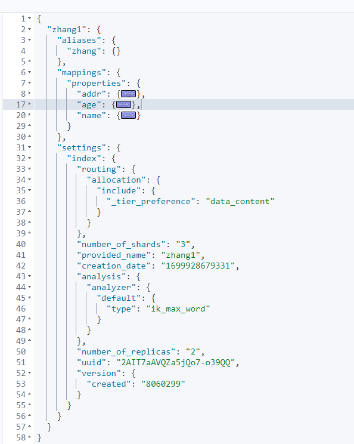
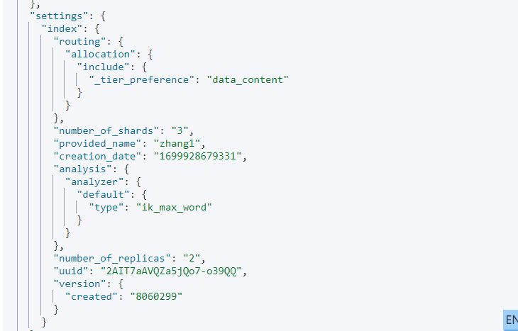

# [ElasticSearch入门](ElasticSearch入门.md)

[TOC]

> [作者：张子尧](https://github.com/ziyao0)
>
>**日期：2023-11-14**

## 一  全文检索

### 1 简介

全文检索是一种通过对文本内容进行全面索引和搜索的技术。它可以快速地在大量文本数据中查找包含特定关键词或短语的文档，并返回相关的搜索结果。全文检索广泛应用于各种信息管理系统和应用中，如搜索引擎、文档管理系统、电子邮件客户端、新闻聚合网站等。它可以帮助用户快速定位所需信息，提高检索效率和准确性。

> **查询**：有明确的搜索条件边界。比如在什么范围内等。即有明确的范围界定。
>
> **检索**：即全文检索，无搜索条件边界，召回结果取决于相关性，其相关性计算无明确边界性条件，如同义词、谐音、别名、错别字、混淆词、网络热梗等均可成为其相关性判断依据。

### 2 全文检索能力

在全文检索中，首先需要对文本数据进行处理，包括分词、去除停用词等。然后，对处理后的文本数据建立索引，索引会记录每个单词在文档中的位置信息以及其他相关的元数据，如词频、权重等。这个过程通常使用倒排索引（inverted
index）来实现，倒排索引将单词映射到包含该单词的文档列表中，以便快速定位相关文档。

当用户发起搜索请求时，搜索引擎会根据用户提供的关键词或短语，在建立好的索引中查找匹配的文档。搜索引擎会根据索引中的信息计算文档的相关性，并按照相关性排序返回搜索结果。用户可以通过不同的搜索策略和过滤条件来精确控制搜索结果的质量和范围。

### 3 倒排索引

正排索引（Forward Index）和倒排索引（Inverted Index）是全文检索中常用的两种索引结构，它们在索引和搜索的过程中扮演不同的角色。

**正排索引（正向索引）**

正排索引是将文档按顺序排列并进行编号的索引结构。每个文档都包含了完整的文本内容，以及其他相关的属性或元数据，如标题、作者、发布日期等。在正排索引中，可以根据文档编号或其他属性快速定位和访问文档的内容。正排索引适合用于需要对文档进行整体检索和展示的场景，但对于包含大量文本内容的数据集来说，正排索引的存储和查询效率可能会受到限制。

在MySQL 中通过 ID 查找就是一种正排索引的应用。

**倒排索引（反向索引）**

倒排索引是根据单词或短语建立的索引结构。它将每个单词映射到包含该单词的文档列表中。倒排索引的建立过程是先对文档进行分词处理，然后记录每个单词在哪些文档中出现，以及出现的位置信息。通过倒排索引，可以根据关键词或短语快速找到包含这些词语的文档，并确定它们的相关性。倒排索引适用于在大规模文本数据中进行关键词搜索和相关性排序的场景，它能够快速定位文档，提高搜索效率。

| 关键词    | 文章ID    | 是否命中索引 |
|--------|---------|--------|
| Java   | 1,2     | √      |
| 设计模式   | 1,2,3,4 | √      |
| 并发编程   | 2       |        |
| Python | 4       |        |

## 二 ElasticSearch

### 1 介绍

[ElasticSearch](https://www.elastic.co/cn/elasticsearch/)
是一个开源的分布式搜索和数据分析引擎，底层是以Java语言开发，是当前最流行的开源的企业级搜索引擎，能够达到近实时搜索，是专门设计用于处理大规模的文本数据和实时性高性能的全文检索。

特点和优势：

+ 分布式架构：ES是一款分布式系统，可以轻松地水平扩展，处理大规模的数据集和高并发的查询请求；
+ 全文检索功能：ES提供了强大的全文检索功能。包括了分词、词项查询、模糊匹配、多字段检索等，并支持丰富的查询语句和过滤器；
+ 多语言支持：支持多种语言的分词器和语言处理器，能很好的处理不同语言的文本数据；
+ 高性能：使用倒排索引和缓存等，具有快速的搜索速度和高效的查询性能；
+ 实用性：支持实时索引和搜索，可以几乎实时的将文档添加到索引中，并立即可见；
+ 易用性：提供了简单易用的restful api，方便进行索引管理、查询操作和数据分析。

### 2 应用场景

只要用到搜索的场景，ES几乎都可以是最好的选择。国内现在有大量的公司都在使用
Elasticsearch，包括今日头条、饿了么、360安全、vivo等诸多知名公司。除了搜索之外，结合Kibana、Logstash、File Beats，Elastic
Stack还被广泛运用在大数据近实时分析领域，包括日志分析、指标监控、信息安全等多个领域。它可以帮助你探索海量结构化、非结构化数据，按需创建可视化报表，对监控数据设置报警阈值，甚至通过使用机器学习技术，自动识别异常状况。

- 搜索引擎
- 站内搜索
- 日志
- 大数据分析

### 3 同类型产品对比

|          | Elasticsearch   | Solr                          | MongoDB        | MySQL      |
|----------|-----------------|-------------------------------|----------------|------------|
| DB类型     | 搜索引擎            | 搜索引擎                          | 文档数据库          | 关系型数据库     |
| 基于何种框架开发 | Lucene          | Lucene                        |                |            |
| 基于何种开发语言 | Java            | Java                          | C++            | C、C++      |
| 数据结构     | FST、Hash等       |                               |                | B+ Trees   |
| 数据格式     | Json            | Json/XML/CSV                  | Json           | Row        |
| 分布式支持    | 原生支持            | 支持                            | 原生支持           | 不支持        |
| 数据分区方案   | 分片              | 分片                            | 分片             | 分库分表       |
| 业务系统类型   | OLAP            | OLAP                          | OLTP           | OLTP       |
| 事务支持     | 不支持             | 不支持                           | 多文档ACID事务      | 支持         |
| 数据量级     | PB级             | TB级~PB级                       | PB级            | 单库3000万    |
| 一致性策略    | 最终一致性           | 最终一致性                         | 最终一致性即时一致性     | 即时一致性      |
| 擅长领域     | 海量数据全文检索大数据聚合分析 | 大数据全文检索                       | 海量数据CRUD       | 强一致性ACID事务 |
| 劣势       | 不支持事务写入实时性低     | 海量数据的性能不如ES随着数据量的不断增大，稳定性低于ES | 弱事务支持不支持join查询 | 大数据全文搜索性能低 |
| 查询性能     | ★★★★★           | ★★★★                          | ★★★★★          | ★★★        |
| 写入性能     | ★★              | ★★                            | ★★★★           | ★★★        |

## 三 环境搭建

[安装文档](https://github.com/ziyao0/knowledge-base/blob/main/%E7%BB%84%E4%BB%B6%E5%AE%89%E8%A3%85/ELK%E6%90%AD%E5%BB%BA%E6%96%87%E6%A1%A3.md)

## 四 Quick Start

### 1 核心概念

#### 1.1 节点

一个节点就是一个Elasticsearch的实例，可以理解为一个 ES 的进程。**注意：一个节点不等于一台服务器。**

#### 1.2 角色Roles

ES的角色分类：

- 主节点（active master）：一般指活跃的主节点，一个集群中只能有一个，主要作用是对集群的管理。
- 候选节点（master-eligible）：当主节点发生故障时，参与选举，也就是主节点的替代节点。
- 数据节点（data node）：数据节点保存包含已编入索引的文档的分片。数据节点处理数据相关操作，如 CRUD、搜索和聚合。这些操作是 I/O
  密集型、内存密集型和 CPU 密集型的。监控这些资源并在它们过载时添加更多数据节点非常重要。
- 预处理节点（ingest node）：预处理节点有点类似于logstash的消息管道，所以也叫ingest pipeline，常用于一些数据写入之前的预处理操作。

**注意：**如果 node.roles 为缺省配置，那么当前节点具备所有角色。

#### 1.3 索引Index

索引在 ES 中所表述的含义和 MySQL 中的索引完全不同，在 MySQL 中索引指的是加速数据查询的一种特殊的数据结构，如 normal index。

而在 ES 中，索引表述的含义等价于 MySQL 中的表（仅针对 ES 7.x 以后版本），注意这里只是类比去理解，索引并不等于表。

在 ES 中，索引在不同的特定条件下可以表示三种不同的意思：

- 表示源文件数据：当做数据的载体，即类比为数据表，通常称作 index 。例如：通常说 集群中有 product 索引，即表述当前 ES 的服务中存储了
  product 这样一张“表”。
- 表示索引文件：以加速查询检索为目的而设计和创建的数据文件，通常承载于某些特定的数据结构，如哈希、FST 等。例如：通常所说的
  正排索引 和 倒排索引（也叫正向索引和反向索引）。就是当前这个表述，索引文件和源数据是完全独立的，索引文件存在的目的仅仅是为了加快数据的检索，不会对源数据造成任何影响，
- 表示创建数据的动作：通常说创建或添加一条数据，在 ES 的表述为索引一条数据或索引一条文档，或者 index 一个 doc
  进去。此时索引一条文档的含义为向索引中添加数据。

**索引的组成部分：**

- alias：索引别名
- settings：索引设置，常见设置如分片和副本的数量等。
- mapping：映射，定义了索引中包含哪些字段，以及字段的类型、长度、分词器等。

#### 1.4 类型Type（ES 7.x 之后版本已删除此概念）

在较早的ES版本中，索引可以包含多个类型，每个类型代表了不同的文档结构。然而，从ES 7.x版本开始，类型已经被弃用，一个索引只能包含一个文档类型。

**ES 7.x**

- 不推荐在请求中指定类型。例如，索引文档不再需要文档type。新的索引 API 适用PUT {index}/_doc/{id}于显式 ID 和POST {index}/_
  doc 自动生成的 ID。请注意，在 7.0 中，_doc是路径的永久部分，表示端点名称而不是文档类型。
- 索引创建、索引模板和映射 API 中的include_type_name参数将默认为false. 完全设置参数将导致弃用警告。
- _default_映射类型被删除 。

**ES 8.x**

- 不再支持在请求中指定类型。
- 该include_type_name参数被删除。

#### 1.5 文档Document

文档是ES中的最小数据单元。它是一个具有结构化JSON格式的记录。文档可以被索引并进行搜索、更新和删除操作。

文档元数据，所有字段均以下划线开头，为系统字段，用于标注文档的相关信息：

- _index：文档所属的索引名
- _type：文档所属的类型名（8以后删除）
- _id：文档唯一id
- _source: 文档的原始Json数据
- _version:  文档的版本号，修改删除操作_version都会自增1
- _seq_no:  和_version一样，一旦数据发生更改，数据也一直是累计的。Shard级别严格递增，保证后写入的Doc的_seq_no大于先写入的Doc的_seq_no。
- _primary_term: _primary_term主要是用来恢复数据时处理当多个文档的_seq_no一样时的冲突，避免Primary Shard上的写入被覆盖。每当Primary
  Shard发生重新分配时，比如重启，Primary选举等，_primary_term会递增1。

### 2 索引操作

[官网](https://www.elastic.co/guide/en/elasticsearch/reference/7.17/index.html)

**创建索引**

~~~json
#格式: PUT /索引名称
PUT /zhang
#响应信息
{
  "acknowledged": true,
  "shards_acknowledged": true,
  "index": "zhang11"
}
~~~

索引命名规范：

- 以小写英文字母命名索引
- 不要使用驼峰命名法则
- 如过出现多个单词的索引名称，以全小写 + 下划线分隔的方式：如test_index。

ES 索引创建成功之后，以下属性将不可修改

- 索引名称
- 主分片数量
- 字段类型

**查询索引**

~~~json
#查询索引
GET /zhang
#响应信息
{
  "zhang11": {
    "aliases": {},
    "mappings": {
      "dynamic": "strict"
    },
    "settings": {
      "index": {
        "routing": {
          "allocation": {
            "include": {
              "_tier_preference": "data_content"
            }
          }
        },
        "number_of_shards": "1",
        "provided_name": "zhang11",
        "creation_date": "1699949797663",
        "number_of_replicas": "1",
        "uuid": "9-yPPiwiTZSM6KWr1BnDNA",
        "version": {
          "created": "8060299"
        }
      }
    }
  }
}
#es_db是否存在
HEAD /zhang
响应信息
200 - OK
~~~

**删除索引**

~~~http
DELETE /zhang
~~~

**设置settings**

~~~json
PUT /zhang
{
  "settings": {
      #主分片 每个分片副本数为2
    "number_of_shards": 3,
    "number_of_replicas": 2,
    "index":{
      #使用ik分词器
      "analysis.analyzer.default.type":"ik_max_word"
    }
  }
}
~~~

**静态索引设置**

只能在创建索引时或在关闭状态的索引上设置。

- index.number_of_shards：索引的主分片的个数，默认为 1，此设置只能在创建索引时设置

**动态索引设置**

即可以使用 _setting API 在实时修改的配置项。

- index.number_of_replicas：每个主分片的副本数。默认为 1，允许配置为 0。
- index.refresh_interval：执行刷新操作的频率，默认为1s. 可以设置 -1 为禁用刷新。
- index.max_result_window：from + size 搜索此索引 的最大值，默认为 10000。

~~~json
#修改索引配置，把每个主分片的副本数量修改为 1
PUT /es_db/_settings
{
    "index" : {
        "number_of_replicas" : 1
    }
}
~~~

**设置文档映射Mapping**

ES 中的 mapping 有点类似与关系数据库中表结构的概念，在 MySQL 中，表结构里包含了字段名称，字段的类型还有索引信息等。在
Mapping 里也包含了一些属性，比如字段名称、类型、字段使用的分词器、是否评分、是否创建索引等属性，并且在 ES
中一个字段可以有多个类型。ES中Mapping可以分为动态映射和静态映射。

~~~tex
查看完整的索引 mapping
GET /<index_name>/_mappings

查看索引中指定字段的 mapping
GET /<index_name>/_mappings/field/<field_name>
~~~

**mapping 的使用禁忌**

- ES 没有隐式类型转换
- ES 不支持类型修改
- 生产环境尽可能的避免使用 **动态映射（**dynamic mapping）

**动态映射**

在关系数据库中，需要事先创建数据库，然后在该数据库下创建数据表，并创建表字段、类型、长度、主键等，最后才能基于表插入数据。而Elasticsearch中不需要定义Mapping映射，在文档写入Elasticsearch时，会根据文档字段自动识别类型，这种机制称之为动态映射。

**自动类型推断规则**

| Json类型  | ES类型                                                                      |
|---------|---------------------------------------------------------------------------|
| String  | 匹配日期格式，设置为date 匹配数字设置为long或者float，该选项默认关闭 设置为Text，并增加keyword子字段 |
| Boolean | boolean                                                                   |
| 整数      | long                                                                      |
| 对象      | object                                                                    |
| 数组      | 有第一个非空数值的类型所决定                                                            |
| 浮点数     | float                                                                     |
| 空值      | 忽略                                                                        |

创建文档

~~~json
PUT /zhang/_doc/2
{
  "name":"李四",
  "age":27,
  "addr":"海淀区"
}
~~~

静态映射

~~~json
PUT /user
{
    "settings":{
        "number_of_shards":3,
        "number_of_replicas":2,
        "index":{
            "analysis.analyzer.default.type":"ik_max_word"
        }
    },
    "mappings":{
        "properties":{
            "name":{
                "type":"keyword"
            },
            "age":{
                "type":"long"
            },
            "addr":{
                "type":"text"
            }
        }
    }
}
~~~

**常用Mapping参数配置**

| **参数名称**              | **释义**                                                                                                                                                                                                                    |
|-----------------------|---------------------------------------------------------------------------------------------------------------------------------------------------------------------------------------------------------------------------|
| **analyzer**          | **指定分析器，只有 text 类型字段支持。**                                                                                                                                                                                                 |
| copy_to               | 该参数允许将多个字段的值复制到组字段中，然后可以将其作为单个字段进行查询                                                                                                                                                                                      |
| **dynamic**           | 控制是否可以动态添加新字段，支持以下四个选项：**true**：（默认）允许动态映射**false**：忽略新字段。这些字段不会被索引或搜索，但仍会出现在_source返回的命中字段中。这些字段不会添加到映射中，必须显式添加新字段。**runtime**：新字段作为运行时字段添加到索引中，这些字段没有索引，是_source在查询时加载的。**strict**：如果检测到新字段，则会抛出异常并拒绝文档。必须将新字段显式添加到映射中。 |
| **doc_values**        | 为了提升排序和聚合效率，默认true，如果确定不需要对字段进行排序或聚合，也不需要通过脚本访问字段值，则可以禁用doc值以节省磁盘空间（不支持 text 和 annotated_text）                                                                                                                            |
| eager_global_ordinals | 用于聚合的字段上，优化聚合性能。                                                                                                                                                                                                          |
| enabled               | 是否创建倒排索引，可以对字段操作，也可以对索引操作，如果不创建索引，任然可以检索并在_source元数据中展示，谨慎使用，该状态无法修改。                                                                                                                                                     |
| **fielddata**         | 查询时内存数据结构，在首次用当前字段聚合、排序或者在脚本中使用时，需要字段为fielddata数据结构，并且创建倒排索引保存到堆中                                                                                                                                                         |
| **fields**            | 给 field 创建多字段，用于不同目的（全文检索或者聚合分析排序）                                                                                                                                                                                        |
| **format**            | 用于格式化代码，如 "data":{"type": "data","format": "yyyy-MM-dd HH:mm:ss\|\|yyyy-MM-dd\|\|epoch_mills"}                                                                                                                       |
| **index**             | 是否对创建对当前字段创建倒排索引，默认 true，如果不创建索引，该字段不会通过索引被搜索到,但是仍然会在 source 元数据中展示。                                                                                                                                                      |
| **norms**             | 是否禁用评分（在filter和聚合字段上应该禁用）                                                                                                                                                                                                 |
| **null_value**        | 为 null 值设置默认值                                                                                                                                                                                                             |
| **search_analyzer**   | 设置单独的查询时分析器                                                                                                                                                                                                               |

**使用ReIndex重建索引**

具体方法：

+ 如果要推倒现有的映射, 你得重新建立一个静态索引
+ 然后把之前索引里的数据导入到新的索引里
+ 删除原创建的索引
+ 为新索引起个别名, 为原索引名

~~~json
PUT /zhang1
{
  "settings": {
    "number_of_shards": 3,
    "number_of_replicas": 2,
    "index":{
      "analysis.analyzer.default.type":"ik_max_word"
    }
  }
}

POST _reindex
{
  "source": {
    "index": "zhang"
  },
  "dest": {
    "index": "zhang1"
  }
}

DELETE /zhang

PUT /zhang1/_alias/zhang

GET /zhang
~~~

条件查询，文档搜索

~~~json
# 查询前10条文档
GET /zhang/_search
# match 匹配查询，会对查询文本分词后匹配
GET /zhang/_search
{
  "query": {
    "match": {
     "addr": "海淀"
    }
  }
}
# term 词项查询，属于精确查询，不会对查询文本分词
GET /zhang/_search
{
  "query": {
    "term": {
      "address": "海淀"
    }
  }
}
~~~

**ElasticSearch文档批量操作**

批量操作可以减少网络连接所产生的开销，提升性能

- 支持在一次API调用中，对不同的索引进行操作
- 可以在URI中指定Index，也可以在请求的Payload中进行
- 操作中单条操作失败，并不会影响其他操作
- 返回结果包括了每一条操作执行的结果

**批量写入**

批量对文档进行写操作是通过_bulk的API来实现的

- 请求方式：POST
- 请求地址：_bulk
- 请求参数：通过_bulk操作文档，一般至少有两行参数(或偶数行参数)

-
  - 第一行参数为指定操作的类型及操作的对象(index,type和id)
  - 第二行参数才是操作的数据

参数类似于：

~~~json
{"actionName":{"_index":"indexName", "_type":"typeName","_id":"id"}}
{"field1":"value1", "field2":"value2"}
~~~

- actionName：表示操作类型，主要有create,index,delete和update
- **批量创建文档create**

~~~json
POST _bulk
{"create":{"_index":"zhang"}}
{"name":"王五","age":27,"addr":"海淀区"}
{"create":{"_index":"article"}}
{"name":"张三","age":27,"addr":"海淀区"}
~~~

